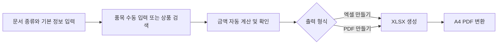
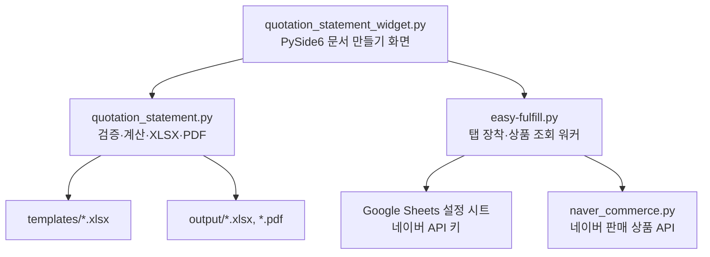

# 견적서·거래명세서 자동화 기능 인수인계서 (웹 이관용)

- 기준일: 2026-08-11
- 기준 저장소: `C:\work\git\easy-fulfill`
- 구현 기준: `88b5269150217243d443baf9a79916b1df84eb13`부터 `696a9b0`까지
- 대상 기능: Easy Fulfill의 마지막 탭 **문서 만들기**

이 문서는 현재 데스크톱 기능을 웹으로 재구현하기 위한 동작 명세다. 화면 모양을 단순히 옮기는 것이 아니라, 아래의 금액 계산·상품 선택·문서 출력 규칙을 동일하게 유지하는 것이 목적이다.

## 1. 현재 기능의 범위

직원이 견적서와 거래명세서를 각각 독립적으로 작성하고, Excel 또는 PDF로 출력한다. 문서는 저장 후 전환하거나 고객 DB와 연결하지 않는다.

주요 기능은 다음과 같다.

- 견적서 / 거래명세서 선택 및 독립 생성
- 스마트스토어 판매가를 기준으로 한 품목 가격 확인
- 상품명·규격·수량·VAT 포함 기준단가의 수동 입력 및 수정
- 주문 총액 기준 할인, 배송비, 공급가액·세액 자동 계산
- 개인정보가 제거된 기존 Excel 양식을 이용한 `.xlsx` 출력
- A4 기준 `.pdf` 출력
- 문서 기본 행 수를 넘는 품목 행 자동 추가
- 상품 목록 조회 실패 시에도 수동 입력으로 계속 문서 생성

현재 화면의 기본 흐름은 아래와 같다.



## 2. 화면 및 사용자 동작

### 2.1 문서 만들기 탭

기존 탭 뒤에 위치한다.

```text
주문발송 | 배송추적 | DB동기화 | 환경설정 | 관리자 | 단건 송장 | 문서 만들기
```

기본 정보는 다음과 같다.

| 항목 | 동작 |
|---|---|
| 문서 종류 | `견적서`, `거래명세서` |
| 소속 | 필수 입력 |
| 성명 | 필수 입력 |
| 거래일자 | 필수 입력, `YYYY.MM.DD` 표시 |
| 결제 방법 | 견적서에서만 선택·출력 |
| 납기 | 견적서에서만 입력, 비어 있으면 `결제 후 즉시` |

견적서 결제 방법은 아래 순서와 출력 문구를 사용한다.

| 선택값 | 문서 출력 문구 |
|---|---|
| 직거래 (기본) | 직접 거래 |
| 네이버 | 네이버 스토어 거래 |
| 쿠팡 | 쿠팡 스토어 거래 |
| G마켓 | G마켓 거래 |
| 옥션 | 옥션 거래 |
| 11번가 | 11번가 거래 |

### 2.2 품목 표

| 열 | 입력/표시 규칙 |
|---|---|
| 상태 | `수동`, `자동`, `수정` |
| API 상품명 (확인용) | 스마트스토어 선택 결과. 직접 수정 불가 |
| 문서용 상품명 | 문서에 출력되는 이름. 자유 수정 가능 |
| 규격 | 자유 입력 |
| 수량 | 1 이상 정수 |
| VAT 포함 단가 | 원 단위 입력, 화면에는 `48,000원` 형식 |

정렬은 헤더 전체 가운데, 상태·규격·수량·단가는 가운데, API 상품명·문서용 상품명은 왼쪽 정렬이다. 선택된 행은 옅은 하늘색 계열로 표시한다.

상태 결정 규칙은 다음과 같다.

- 처음부터 직접 입력한 행: `수동`
- API 상품명과 API 가격을 그대로 적용한 행: `자동`
- API 적용 후 문서용 상품명·규격·단가 중 하나라도 바꾼 행: `수정`

### 2.3 상품 검색

상품명 전체를 기억하거나 SEO용 긴 이름을 그대로 입력하도록 강제하지 않는다.

1. 사용자가 짧은 검색어를 입력하고 품목 행을 선택한다.
2. 서버가 스마트스토어 판매 중 상품 목록을 준비한다. 데스크톱은 탭 첫 진입 시 세션 메모리에 미리 적재한다.
3. 검색어를 공백 단위 토큰으로 나누어 상품명에 모두 포함되는 결과를 표시한다.
4. 팝업에서 상품번호, 스마트스토어 상품명, 기준가격, 상품 페이지 링크를 표시한다.
5. 상품명 행을 더블클릭하거나 `적용`을 누르면 API 상품명·문서용 상품명·단가를 채운다.
6. 발행자는 문서용 상품명과 규격을 필요에 맞게 줄이거나 수정한다.

상품 페이지 링크 형식은 다음과 같다.

```text
https://smartstore.naver.com/higenis/products/{product_no}
```

API 실패, 검색 결과 없음, 네이버 인증 실패가 발생해도 품목 표의 직접 입력과 문서 출력은 막지 않는다.

## 3. 확정 금액 계산 규칙

### 3.1 공통 원칙

- 모든 입력 단가는 **VAT 포함 단가**다.
- 할인 기준은 배송비를 제외한 모든 품목의 `VAT 포함 단가 × 수량` 합계다.
- 수량 조건은 사용하지 않는다.
- 부동소수점 대신 `Decimal`과 원 단위 `ROUND_HALF_UP` 반올림을 사용한다.
- 할인율은 품목 합계로 한 번 결정하고 모든 품목의 개별 단가에 적용한다.
- 할인액은 계산에 반영하지만 견적서·거래명세서 본문에 별도 `할인` 행이나 금액으로 출력하지 않는다.

### 3.2 할인 및 배송비

| 할인 전 품목 합계 | 할인율 | 배송비 |
|---:|---:|---:|
| 100,000원 이하 | 0% | 3,000원 추가 |
| 100,000원 초과 ~ 2,000,000원 이하 | 5% | 없음 |
| 2,000,000원 초과 ~ 5,000,000원 이하 | 10% | 없음 |
| 5,000,000원 초과 | 별도 협의 | 자동 계산하지 않음 |

경계값은 아래와 같이 고정한다.

```text
100,000원: 0% + 배송비 3,000원
100,001원: 5%
2,000,000원: 5%
2,000,001원: 10%
5,000,000원: 10%
5,000,001원: 별도 협의 확인 필요
```

5,000,000원 초과는 사용자가 `협의 완료`를 확인하기 전에는 출력할 수 없다. 협의 완료 시에는 현재 입력 단가를 그대로 사용하며 자동 할인·배송비를 더하지 않는다.

### 3.3 품목별 계산식

```text
할인 전 품목 합계 = Σ(VAT 포함 기준단가 × 수량)
할인율 = 위 합계로 결정
할인 후 VAT 포함 단가 = 원 단위 반올림(기준단가 × (1 - 할인율))
공급 단가 = 원 단위 반올림(할인 후 VAT 포함 단가 ÷ 1.1)
세액 단가 = 할인 후 VAT 포함 단가 - 공급 단가
공급가액 = 공급 단가 × 수량
세액 = 세액 단가 × 수량
최종 합계 = Σ(공급가액 + 세액) + 배송비
```

배송비 3,000원은 공급가액 2,727원, 세액 273원으로 별도 품목 행에 출력한다.

예: 10,000원 상품 400개는 할인 전 4,000,000원이므로 10% 할인이다. 할인 후 단가는 9,000원, 공급 단가는 8,182원, 세액 단가는 818원이다.

## 4. 문서 출력 규격

### 4.1 Excel 양식

양식 파일은 다음 두 개다.

```text
templates/quotation_template.xlsx
templates/transaction_statement_template.xlsx
```

공급자 정보·도장·병합·테두리·열 너비·행 높이·인쇄 설정은 양식에 보존한다. 고객 개인정보와 샘플 거래 내용은 제거된 상태다.

| 구분 | 견적서 | 거래명세서 |
|---|---:|---:|
| 기본 품목 행 수 | 7 | 6 |
| 품목 시작 행 | 16 | 10 |
| 기본 합계 행 | 23 | 16 |
| 공급가액 열 | R | Q |
| 세액 열 | V | T |
| VAT 포함 총액 위치 | R12 | H7 |

기본 행 수를 넘으면 합계 행 바로 위에 필요한 수만큼 행을 추가한다. 새 행은 기준 품목 행의 병합·서식·테두리·정렬·행 높이를 복제한다. 웹 구현도 행 추가 시 이 동작을 유지해야 한다.

견적서의 금액 제목과 거래명세서의 합계 제목은 서식이 분리된다.

- `견적금액`, `합계`: 14pt
- `(공급가액 + 세액)`, `(부가세 포함)`: 9pt

견적서 하단은 `기타` → `기본 납기` → `결제 방법` 순서다. 과거 할인 항목의 빈 행은 숨기고 인쇄영역에서 제외한다. 견적서 인쇄는 상단 기준이며 세로 가운데 맞춤을 사용하지 않는다.

### 4.2 파일명

```text
견적서_{소속}_{성명}_{거래일자}.xlsx
거래명세서_{소속}_{성명}_{거래일자}.xlsx
견적서_{소속}_{성명}_{거래일자}.pdf
거래명세서_{소속}_{성명}_{거래일자}.pdf
```

- 거래일자는 `YYYY.MM.DD`
- Windows 파일명 금지 문자는 제거
- 같은 이름의 XLSX 또는 PDF가 이미 있으면 `_(1)`, `_(2)` 순으로 번호를 붙여 덮어쓰지 않음

### 4.3 PDF

데스크톱은 Excel COM과 Microsoft Print to PDF를 이용해 양식의 인쇄 결과를 A4 세로 PDF로 만든다.

- A4 (`PaperSize=9`), 세로 방향, 너비 1페이지 맞춤
- PDF 버튼은 별도 작업 스레드에서 실행하고 무한 진행 표시를 유지
- 변환 중 사용자의 기본 프린터를 Microsoft Print to PDF로 임시 선택한 뒤 원래 프린터로 복원
- `RPC_E_CALL_REJECTED` 등 Excel 종료 단계 오류는 `Close`·`Quit`을 최대 3회 재시도
- PDF가 이미 생성됐다면 종료 오류를 변환 실패로 처리하지 않음
- 변환 진단은 `output/pdf_export.log`에 남김

웹에서는 Excel COM과 사용자의 로컬 프린터를 사용할 수 없다. 아래 중 하나를 별도 선정해야 한다.

1. 서버에서 XLSX를 만든 뒤 검증된 Office 호환 변환기로 PDF 변환
2. 동일한 A4 레이아웃을 HTML/CSS 또는 PDF 템플릿으로 렌더링

어느 방식을 쓰든 기존 양식과 비교한 시각 검증이 필요하다. 특히 도장 이미지, 병합 표, 글자 크기, 행 추가, A4 여백을 확인한다.

## 5. 현재 데스크톱 구조



| 파일 | 책임 |
|---|---|
| `quotation_statement.py` | 입력 검증, `Decimal` 계산, 행 추가, Excel 양식 채움, 출력 파일명, Excel COM PDF 변환 |
| `quotation_statement_widget.py` | PySide6 화면, 품목 상태, 상품 선택 팝업, 생성 확인, PDF 작업 스레드·진행 창 |
| `easy-fulfill.py` | 마지막 탭 장착, Google Sheets 설정 조회, 네이버 상품 조회 워커, 실패 진단 로그 |
| `naver_commerce.py` | 네이버 토큰 발급과 판매 중 스마트스토어 상품 목록 조회 |
| `templates/*.xlsx` | 출력 양식과 도장 포함 공급자 정보 |
| `test_quotation_statement.py` | 계산 경계값, 행 확장, 템플릿 서식, PDF 오류 복구 테스트 |

## 6. 스마트스토어 연동 및 실패 진단

### 6.1 현재 데스크톱 연동

1. Google Sheets OAuth로 공유 설정 시트를 연다.
2. 설정 시트의 `naver_client_id`, `naver_client_secret`을 읽는다.
3. 네이버 Commerce API 토큰을 발급한다.
4. `POST /external/v1/products/search`로 `SALE` 상태 상품을 페이지당 500개씩 가져온다.
5. `STOREFARM` 채널만 남기고 `discountedPrice`가 0보다 크면 그 값을, 아니면 `salePrice`를 기준가격으로 사용한다.

상품 목록은 데스크톱 실행 중 메모리에만 캐시한다. 브라우저에 API 비밀값이나 네이버 토큰을 보내지 않는다.

### 6.2 실패 시 진단

데스크톱 `run.bat` 실행에서는 다음 단계 중 실패한 위치와 traceback을 콘솔 및 `logs/document_product_search.log`에 기록한다.

- 의존성 확인
- 모듈 불러오기
- Google Sheets 인증
- 공유 설정 시트 조회
- 네이버 API 키 확인
- 네이버 토큰 발급
- 스마트스토어 판매 상품 목록 조회

웹에서도 같은 단계명을 서버 로그와 사용자용 오류 코드로 남기는 것을 권장한다. 단, 사용자 화면과 브라우저 로그에는 API 비밀값·토큰·Authorization 헤더를 절대 기록하지 않는다.

## 7. 웹 이관 구현 계약

### 7.1 권장 분리

| 계층 | 책임 | 주의점 |
|---|---|---|
| 웹 UI | 기본 정보·품목 입력, 계산 요약, 상품 선택, 생성 요청 | 문서용 상품명·규격은 항상 수정 가능해야 함 |
| 문서 API | 입력 검증, 할인/VAT/배송비 계산, 파일 생성 요청 | 계산 결과를 클라이언트와 서버에서 다르게 구현하지 말 것 |
| 상품 검색 API | 네이버 인증·상품 목록 캐시·검색·링크 반환 | 네이버 비밀값과 토큰은 서버 전용 |
| 문서 렌더러 | XLSX/PDF 생성, 템플릿 관리, A4 시각 검증 | Excel COM·기본 프린터 의존을 제거 |
| 저장소 | 생성 파일, 선택적 발행 이력 | 현재 데스크톱에는 고객/문서 DB가 없음 |

웹 API의 최소 계약 예시는 다음과 같다.

```text
POST /api/document-calculations
POST /api/smartstore-products/search?q=fdcan
POST /api/documents/xlsx
POST /api/documents/pdf
GET  /api/documents/{id}/download
```

품목 요청 모델은 최소한 아래 필드를 가진다.

```json
{
  "documentType": "견적서",
  "organization": "한국대학교",
  "name": "홍길동",
  "tradeDate": "2026-08-11",
  "paymentMethod": "직거래",
  "deliveryTerm": "결제 후 즉시",
  "negotiated": false,
  "items": [
    {
      "apiName": "API 확인용 상품명",
      "documentName": "문서 출력 상품명",
      "specification": "Ver1",
      "grossUnitPrice": 48000,
      "quantity": 1
    }
  ]
}
```

`apiName`은 확인·감사용이며 PDF/XLSX 본문에는 `documentName`, `specification`만 출력한다.

### 7.2 웹 이관 시 반드시 유지할 것

- 원 단위 반올림 위치와 할인 경계값
- 상품 목록 API 실패 시 수동 입력 계속 가능
- 상품명 원본과 문서용 상품명 분리
- 출력 전 최종 품목·공급가액·세액·합계 확인
- 중복 파일명 방지 또는 동등한 발행 식별자 정책
- 템플릿의 공급자 정보·도장·A4 시각 품질
- 5,000,000원 초과 협의 확인 절차

### 7.3 웹 이관 전에 결정할 항목

현재 데스크톱에 없는 영역이므로 임의로 추가하지 않는다.

- 사용자 로그인·권한: 누가 네이버 상품 검색과 문서 발행을 할 수 있는지
- 문서 보관 기간 및 고객 개인정보 접근 권한
- 견적서 수정 이력·재발행 정책
- 생성 파일을 로컬 다운로드만 할지, 서버 보관·공유 링크를 제공할지
- 웹 PDF 렌더러와 Excel 양식 호환성 확보 방식
- 네이버 API 키를 Google Sheets 대신 비밀 저장소로 옮길지 여부

## 8. 검증 기준

웹 구현은 아래 항목을 자동 테스트와 실제 출력 비교로 통과해야 한다.

### 8.1 계산 테스트

- 100,000 / 100,001 / 2,000,000 / 2,000,001 / 5,000,000 / 5,000,001원 경계값
- 10,000원 × 400개: 할인 후 9,000원, 공급 단가 8,182원, 세액 단가 818원
- 배송비 3,000원: 공급가액 2,727원, 세액 273원
- 여러 품목에 하나의 총액 할인율 적용
- 수량 0, 소수 수량, 빈 상품명, 빈 단가 거부

### 8.2 출력 테스트

- 견적서 1·7·8개 품목
- 거래명세서 1·6·7개 품목
- 배송비 포함/미포함
- 긴 상품명 줄바꿈과 행 높이
- 도장 이미지, 병합, 테두리, 숫자 `원`/천 단위 표기, 제목 글자 크기
- 견적서 납기 기본값·입력값, 결제 방법 문구, 할인 빈 행 미출력
- A4 상단 정렬, PDF 1페이지/다페이지 동작
- 중복 파일명 번호 부여

### 8.3 현재 데스크톱 회귀 명령

```powershell
python -m unittest test_quotation_statement.py
python -m py_compile easy-fulfill.py quotation_statement.py quotation_statement_widget.py naver_commerce.py
git diff --check
```

## 9. 구현 이력

| 커밋 | 내용 |
|---|---|
| `88b5269` | 계산·템플릿·문서 만들기 탭·상품 검색의 최초 구현 |
| `8bd9cac` | Excel 출력 및 도장 이미지 보존 개선 |
| `972b5ed` | 화면 사용성, A4 PDF 출력, 비동기 PDF 대기 표시 개선 |
| `ad1a343` | 금액 제목 서식, 원화 표기, 출력 파일명 개선 |
| `1250b0` | 상품 검색·팝업·표 정렬·버튼 문구 등 문서 화면 사용성 개선 |
| `f2c990f` | 견적서 납기 입력과 기본 납기 처리 |
| `980fb8b` | 견적서 PDF 세로 가운데 맞춤 해제 |
| `ce136df` | 삭제된 할인 항목의 빈 행 제거 |
| `aedde26` | Excel COM 종료 오류 재시도와 PDF 변환 진단 로그 |
| `696a9b0` | 타 PC 상품 목록 준비 실패 단계·traceback 로그 |

이 문서는 데스크톱 구현의 현재 상태를 기준으로 한다. 웹 이관 중 업무 규칙을 바꾸려면 화면이나 PDF 서식보다 먼저 3장의 계산 규칙과 검증 기준을 갱신해야 한다.
